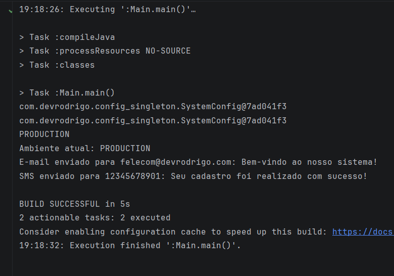

# Notification & Configuration System — Design Patterns

Este é um projeto desenvolvido em **Java 26** para demonstrar a aplicação prática de padrões de projeto (*Design Patterns*) recomendados pela Gang of Four (GoF) e pelas melhores práticas de mercado. O objetivo principal é resolver problemas comuns de arquitetura — como gerenciamento de estado global único, encapsulamento de sistemas complexos e alternância dinâmica de algoritmos — mantendo o código limpo, testável e de fácil manutenção.

---

## 🏛️ Padrões de Projeto Implementados

O projeto foi estruturado utilizando três padrões fundamentais, distribuídos de forma isolada em pacotes profissionais:

### 1. Singleton (Abordagem: *Lazy Holder*)
* **Localização**: `com.devrodrigo.config_singleton.SystemConfig`
* **Objetivo**: Gerencia as configurações globais do sistema de forma centralizada.
* **Diferencial Técnico (Foco do Portfólio)**: Foi implementada a variação **Lazy Holder** (ou *Initialization-on-demand holder idiom*). Essa abordagem utiliza o mecanismo de carregamento de classes da própria Máquina Virtual Java (JVM) para garantir que a instância seja criada de forma *lazy* (apenas quando utilizada) e seja nativamente segura contra concorrência (*thread-safe*), eliminando a necessidade e o custo de performance de blocos `synchronized`. O construtor foi definido como `private` para impedir instanciações indevidas via operador `new`.

### 2. Strategy
* **Localização**: `com.devrodrigo.strategy`
* **Objetivo**: Permite que o mecanismo de envio de mensagens mude dinamicamente em tempo de execução sem alterar o cliente que o consome.
* **Diferencial Técnico (Foco do Portfólio)**: Criação de uma interface comum (`NotificationStrategy`) e classes isoladas para cada canal (`EmailStrategy` e `SmsStrategy`). Isso atende diretamente aos princípios do **SOLID**, especificamente o **Princípio da Responsabilidade Única (SRP)** e o **Princípio Aberto/Fechado (OCP)**, permitindo adicionar novos canais (como WhatsApp ou Telegram) apenas criando novas classes, sem modificar o código existente.

### 3. Facade (Fachada)
* **Localização**: `com.devrodrigo.facade.NotificationFacade`
* **Objetivo**: Fornecer uma interface simplificada para um subsistema complexo de notificações.
* **Diferencial Técnico (Foco do Portfólio)**: A classe `Main` não precisa conhecer os detalhes de implementação das estratégias de envio nem gerenciar dependências. A `NotificationFacade` encapsula toda a orquestração do comportamento, provendo métodos limpos e intuitivos para o ponto de entrada da aplicação.

---

## 📂 Estrutura do Projeto

A arquitetura de pacotes segue o padrão profissional de mercado adotado em grandes projetos corporativos:

```text
📂 src/main/java/
    └── 📂 com.devrodrigo/
        ├── 📂 config_singleton/
        │     └── SystemConfig.java             # Singleton (Lazy Holder)
        ├── 📂 strategy/
        │     ├── NotificationStrategy.java     # Interface comum da estratégia
        │     ├── EmailStrategy.java            # Implementação de envio de e-mail
        │     └── SmsStrategy.java              # Implementação de envio de SMS
        ├── 📂 facade/
        │     └── NotificationFacade.java       # Fachada unificadora do sistema
        └── Main.java                           # Ponto de entrada do sistema
```

---

## ⚙️ Pré-requisitos e Versão do Java

Para compilar e executar este projeto, certifique-se de cumprir os seguintes requisitos:

* **Java Development Kit (JDK)**: Versão **26** ou superior.
* **Recursos de Linguagem Utilizados**: O projeto faz uso de **Classes Declaradas Implicitamente e Métodos Main de Instância** (recurso consolidado no Java moderno), permitindo que o arquivo `Main.java` execute o método `void main()` diretamente na raiz do arquivo, sem a necessidade obrigatória de uma declaração visual de classe ou de parâmetros fixos `String[] args`.
* **Gerenciador de Dependências**: Gradle (configuração inclusa na raiz).

---

## 🚀 Como Executar o Projeto

1. Certifique-se de que a sua variável de ambiente `JAVA_HOME` esteja apontando para a raiz do seu JDK 26 (sem incluir a pasta `\bin` no valor da variável global).
2. Certifique-se de que o seu `Path` do sistema contenha a instrução `%JAVA_HOME%\bin`.

3. Clone o repositório completo do Bootcamp em sua máquina ou faça download do projeto:
   ```bash
   git clone https://github.com/rodrigomgrassioto/BootcampSantander2026-01
   ```
4. Pelo terminal ou por sua IDE, navegue até a pasta específica deste projeto:
   ```bash
   cd BootcampSantander2026-01/Projetos/451-MyProj-DesignPatternJavaPuro
   ```
5. Abra o terminal na raiz do projeto e execute a compilação limpa utilizando o Gradle Wrapper:
    * **Linux/macOS**:
      ```bash
      ./gradlew clean build
      ```
    * **Windows**:
      ```powershell
      .\gradlew.bat clean build
      ```

6. Execute o arquivo **Main.java** através da sua IDE de preferência (IntelliJ IDEA ou VS Code) configurada com o SDK correspondente ao Java 26.


---

## 🧪 Validação dos Testes na Main

Ao rodar a aplicação, o ponto de entrada valida o comportamento esperado dos padrões:
* O sistema imprime em tela duas referências de variáveis do Singleton, demonstrando que ambas apontam **exatamente para o mesmo endereço de memória**.
* O fluxo condicional verifica o ambiente de execução ativo e delega o processamento transparente à fachada de notificações de forma limpa.

## ✅ Resultado esperado:


## Observação, sobre Spring:
Como ainda não tenho conhecimento sobre Spring pretendo após concluir o módudo dele, fazer esse mesmo projeto mas dai usando o Spring.

## 🤝 Conecte-se Comigo
Estou focado em projetar arquiteturas backend sólidas, aplicando as melhores atualizações do ecossistema Java. Sinta-se à vontade para analisar meus repositórios ou entrar em contato!

👉 [Acesse meu perfil no LinkedIn para Networking](https://www.linkedin.com/in/devrod)